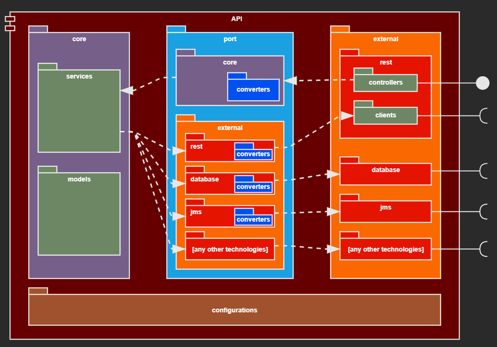

# Read Me First
* This is a simple REST API, just to try a new package structure

### How to run the application
* #### Requirements
  * There is needed a MySql database running
* #### Environment variables
  * There is needed to configure the following environment variables:
    * **DBSERVER** (Server that Database is running)
    * **DBPORT** (Port that Database is running)
    * **DBNAME** (Database name)
    * **DBUSERNAME** (Username to access this database)
    * **DBPASSWORD** (Password to access this database)

* #### Running
  * Run the following command inside the root directory (or just run the main class in your IDE):
    ````
    mvn spring-boot:run
    ````
### Reference Package Diagram
* I created this structure in order to isolate ***"Core"*** and ***"External"*** layers.
* In this structure, ***"Core"*** and ***"External"*** layers does not know about each other and ***"Port"*** layer make the "bridge" between both other layers.
* This structure was initially based on hexagonal architecture and onion architecture

